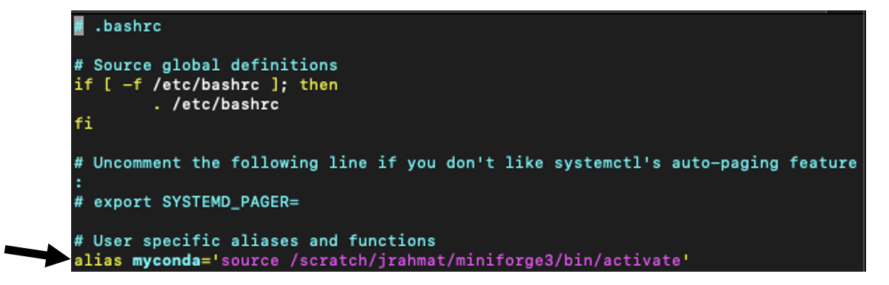
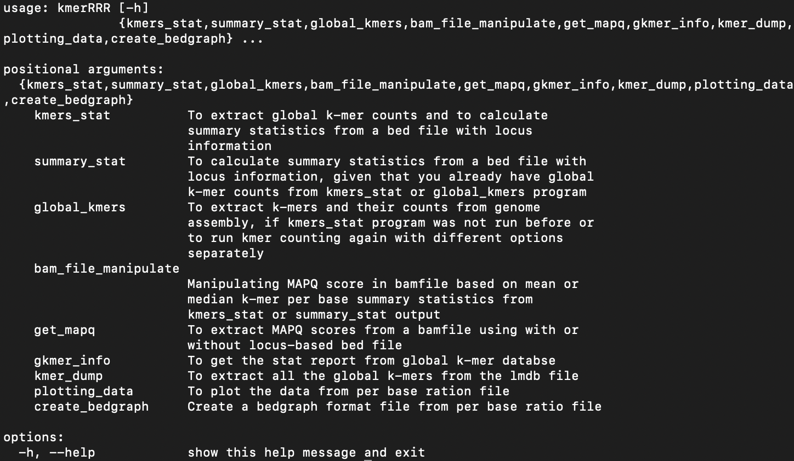
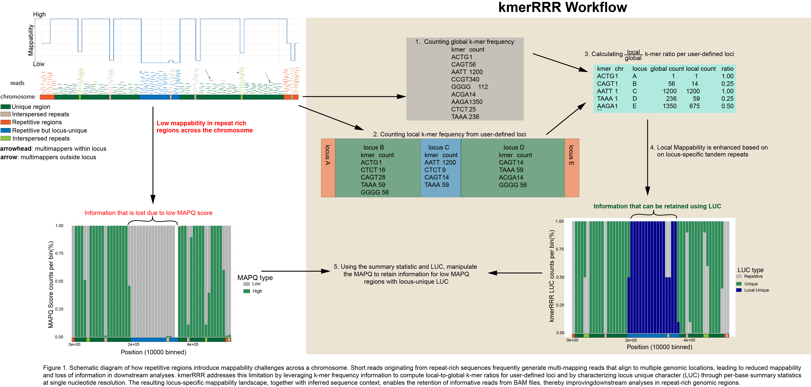
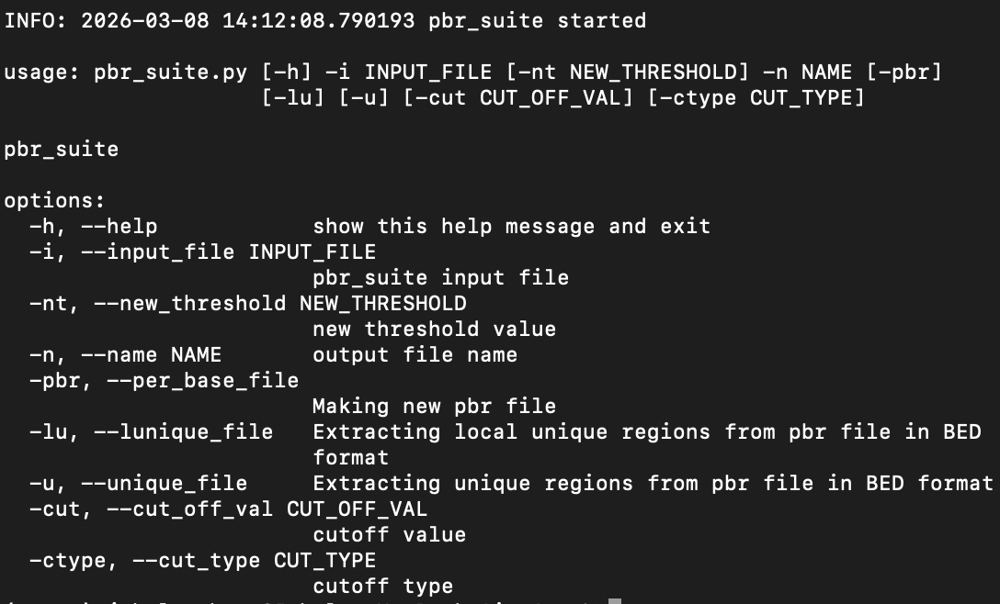

# Documentation for kmerRRR: A k-mer based method for functional genomics in Repeat Rich Regions


### This documentation is for the kmerRRR version 0.1.0

>Anything in <span style="color: orange;"> */path/to/your/directory*</span> is a placeholder. Make sure to change them with the actual path of your desired directory

This program was created for python version __3.6__ and greater. To install the program, download the latest tar.gz file from [here](), or you can simply clone this repository then follow the instructions below to install it.

```code
git clone https://github.com/LarracuenteLab/kmerRRR
```

><span style="color: red;">Caution: kmerRRR requires jellyfish to be installed previously to be able to run the scripts with jellyfish parameter. Using jellyfish is recommended for moderate to larger genomes for faster runtime.</span>

If jellyfish is not installed, kmerRRR can be run with its default option, which uses python's dictionary (hash table) to count k-mer frequency. However, the runtime will be much slower.

To install jellyfish locally, please use the instruction from jellyfish **[github](https://github.com/gmarcais/Jellyfish/blob/master/README.md)** page. However, if working from a high performance computing cluster or have previously installed jellyfish version >=2.3, no need to install jellyfish separately.

To install kmerRRR version 0.1.0, you will require miniforge3 and an active python virtual environment. Please follow the instruction below.

If you already have miniforge3 and python virtual environment (venv) installed and running, you can go [here directly to use the kmerRRR](#3installing-kmerrrr-version-010-and-its-usage) 

### Installing kmerRRR version 0.1.0

To use the program please follow the steps:

### 1.	Installing miniforge3 and running conda environment

To use the tool, you will be required to have miniforge3 installed and running. To install miniforge3 and running the software please follow the direction below:
```code 
wget https://github.com/conda-forge/miniforge/releases/latest/download/Miniforge3-Linux-x86_64.sh -O miniforge.sh
```

Here, you are downloading miniforge for linux for 64 bits in the directory you are currently in and chaning the name of shell script (.sh) file to “miniforge.sh”.
Run the shell script using the following (It is recommended to choose your scratch base as the path/name of the directory):

```code
bash miniforge.sh -b -p /path/to/your/directory
```
To activate conda from the miniforge use

```code
source /path/to/your/directory/miniforge3/bin/activate
```
Or, to avoid using the above line, you can open your bashrc file using your desired text editor (e.g., vim or nano) and write down the following under <span style="color: red;">**“# User specific aliases and functions”**</span>

To open your .bashrc use:
```code
vim ~/.bashrc #or
nano ~/.bashrc
```
Then write:
```code
alias myconda='source /path/to/your/directory/miniforge3/bin/activate'
```
This way you can activate conda environment anytime just typing *"myconda"* in the terminal.


>Fig1: Showing what the contents of the .bashrc file look like. The arrow shows where to put the **alias** to activate conda using command *“myconda”*

Once, miniforge3 is installed and conda is activated move to step2

### 2.	Creating and activating python virtual environment

Open a python virtual environment using:
```code
python3 -m venv venv
```
You will be able to see a directory called *venv/* in the directory you executed the code

To activate venv use:
```code
source venv/bin/activate
```
>To exit the virtual environment just type in *deactivate* and press enter

To activate it again ensure you are in the folder where *venv/* directory lives <span style="color: orange;">*/path/to/your/directory/venv*</span> and type in
```code
source venv/bin/activate
```

To use the kmerRRR tools make sure to <span style="color: red;">**activate conda and venv**</span>

### 3.	Installing kmerRRR version 0.1.0 and its usage

If you are not using git clone, use this[link](https://github.com/LarracuenteLab/kmerRRR) to download the latest kmerRRR.tat.gz file. At first, untar the kmerRRR.tar.gz in the folder where it has been downloaded

```code
tar -xzvf kmerRRR.tar.gz
```

The directory tree looks like:

```
kmerRRR
├── companion_scripts
├── example.codes
├── kmerRRR
│   └── R
├── kmerRRR.egg-info
├── ReadMe
└── test.files
```

Then, go to the kmerRRRR folder using:

```code
cd kmerRRRR
```

>To install the kmerRRR program, first ensure that <span style="color: red;">*__venv__*</span> is activated, then follow the instructions below:

```code
python3 -m pip install -e .
```

Now, you have installed the program in your *venv*. You can access it by calling the program name *kmerRRR* from any directory when *venv* is activated. 

To test whether the program has installed correctly, use:

```code
kmerRRR -h #or
kmerRRR --help
```

An output with all the programs available will be printed in the stdout.


>Fig2. Showing the output of kmerRRR --help. All the programs and their description will be output in stdout

If you see the above image, the program has been installed successfully and ready to use.

Now, you will be able to use different programs from **kmerRRR**

Some test scripts can be found [here](#test-scripts)

If you want to submit the job as a SLURM using sbatch, information to do so can be found [here](#now-if-you-want-to-submit-the-job-in-slurm-using-sbatch-do-the-following)

#### Common usage
```code
kmerRRR kmers_stat -seq "test.files/test.fasta" -k 31 -c 1 -n test.kmer -bed "test.files/contig.bed" --plot -g 200 -t 4 -jf -sw 100 -rr 1 
```

The sequence file in the _test.files_ folder is a dummy genome. The annotation of the genome is as follows:


Here, *kmerRRR* is calling the tool to run kmers_stat script, *-seq* parameter for the **sequence file**, *-k* is the kmer size in **integer**, *-c* followed by **1** to ensure canonical kmer counting (**0** for non-canonical), *-n* for **path/name** of the program, *-bed* for **path/name** of the locus file, *--plot* to produce plots for mean and median per base k-mer ratio using the summary statistics, *-g* for genome size in megabase (Mb), *-t* for the number of threads to be used, *-jf* to use jellyfish, *-sw* for plotting with a sliding window of 100, and *-rr* to use a k-mer ratio of 1.0 to designate repetitive locus as calculated per base.



>When you use path ensure you don’t stop at the folder <span style="color: orange;">*/path/to/your/directory*</span> but end with the name you want to give to your output files, e.g., <span style="color: orange;">*/path/to/your/directory*</span>/<span style="color: green">**test**</span>, here change the name from <span style="color: green">**test**</span> to anything you want.

There are 8 scripts in the folder. You can view them using

```code
kmerRRR -h
```

*kmers_stat*: To extract global k-mer counts and to calculate summary statistics from a bed file with locus information.

*get_mapq*: To extract mapq scores from bamfile for specific contigs

*bam_file_manipulate*: To manipulate the bamfile mapq scores either using mean or median per base kmer ratio for specific contigs/chromosomes

*gkmer_info*: To get the stat report from global k-mer databse, for example, number of singletons, distinct k-mers, and max k-mer with its count

*kmer_dump*: To extract all the global k-mers from the lmdb file

>Use this script to extract the global k-mers only. If using jellyfish, you can use jellyfish and it command directly to count global k-mers. Please follow the jellyfish documentation [here](https://github.com/gmarcais/Jellyfish).

*global_kmers*: To extract kmers and their counts from the genome assembly 

>Use this script to get the summary statistics from a global k-mer file for user-defined regions using bed+locus file.  

*plotting_data*: To plot the data from per base ratio file or MAPQ data

*create_bedgraph*: Create a bedgraph format file from per base ratio file or MAPQ data before and after manipulation to visulaize it using genome browser 

*summary_stat*: To calculate summary statistics from a bed file with locus information and global k-mer count file.

>Given that you already have global k-mer counts from kmers_stat or global_kmers program, and want to run summary statistics for a different chromosome and locus.

<span style='color: red'>**Before running any of the programs, ensure that **miniforge** and **venv** is activated. If not, activate it using**</span>

```code
source /path/to/your/directory/miniforge3/bin/activate

source /path/to/your/directory/venv/bin/activate #to activate the virtual environment
```

## Follow the following steps to use kmerRRR tool 
>The ones that are in bold and highlighted in grey are required options

1. Extracting global k-mer counts and summary statistics.

At first run the *kmers_stat* program to get the global k-mers count and a summary statistic for k-mer ratio for interested locus

Code Snippet

```code
kmerRRR kmers_stat -seq <sequence.fasta> -bed <locus.bed> -c 1 -k 61 -n "name" --plot
```
<span style="background-color: grey;">**-seq or --sequence_file**</span>: Path or name to the sequence file in FASTA or FASTQ format in gzipped or not

<span style="background-color: grey;">**-bed or --bed_file**</span>: Path or name to the locus file in BED format with a locus column defining locus name (e.g., chromosome1	23500	123500	centromere)

><span style="color: red;">When using the locus file please make sure to look at an example of the modified bed file (contig.bed) with an additional column for locus name inside the test.examples folder in kmerRRR_0.1.0. Just follow the first three column in a typical bed file (tab delimited) and the fourth column should be the name of the locus</span>

<span style="background-color: grey;">**-n or –name**</span>: Name for the output files

<span style="background-color: grey;">**-k or --kmer_size**</span>: Size in **integer** for the k-mer size

<span style="background-color: grey;">**-g or --genome_size**</span>: Genome size of the organism in ** megabase (Mb)**

>This will be used by the jellyfish command to create the hash size

-t or --threads: Whether to use multithreads for jellyfish

-c or -–canonical (**default is 0**): Whether to output canonical kmers (0 for no, 1 for yes)

-p or -–plot: Generate plot of mean and median per-base ratio, default: False

-jf or --jellyfish: To generate the global k-mers count using jellyfish (default false)

-sw or --slide_window (**default is 10kb**): Window size to use for plotting mean and median for positions from per base ratio file output 

-rr or --repeat_ratio (**default is 0.9**): Threshold to designate per base as repetitive.

><span style="color:green;">**While running jellyfish using kmerRRR in a clustered high performance computer system, a typical error stating that the C++ compiler is not found can halt the execution of the program. To resolve the issue, module load gcc version 14.2.0 or higher or provide the path to the gcc version 14.2.0 or higher.</span>

This will output a *{name}*_global_kmers.txt file containing the kmers and their counts in a tab delimited file, a *(name)*_kmer_ratio.txt and *{name}*_per_base_ratio.txt for local/global kmer counts and per base kmer ratio for each locus and their respective contigs/chromosomes, respectively and also if user wants *{name}*_{contigName}.png bar plots of per base k-mer ratio for each contig. If jellyfish option was used, the program will output a *{name}*_global_kmers.jf file containing the k-mers, their counts, and information in jellyfish data structure. To dump the k-mers into a .txt.gz file use the *kmer_dump* program or you can use the jellyfish dump as suggested in their [documentation](https://github.com/gmarcais/Jellyfish).

2. Getting MAPQ scores from bamfile.

Now, you have the plots and summary statistics for targeted locus or contigs. You can use the default values of either mean (default option) or median to manipulate the bamfile then go to step 3, or if you want to see the distribution of MapQ and then decide the cutoff value and type of statistics to use to manipulate the bamfile, you can use the *get_mapq* program to fetch the MAPQ scores either for the whole contig or for the interested locus.

Code Snippet

```code
kmerRRR get_mapq -bam <file.bam> -bed <file.bed> -n "name" -locus
```
<span style="background-color: grey;">**-bam or --bam_file**</span>: Path or name of the bam file

<span style="background-color: grey;">**-bed or –bed_file**</span>: Path or name of the bed file containing locus information

<span style="background-color: grey;">**-n or –name**</span>: Path or name of the program

-locus or -–locus_based (**default is True**): Whether the MAPQ will be fetched for targeted locus/loci

-p or -–plot: Generate plot of MAPQ

-sw or --slide_window (**default is 10kb**): Window size to use for plotting mean and median for positions from per base ratio file output 

This will produce a *{name}*_MapQ.txt file which will be a tab delimited file containing information about targeted contigs and their MapQ scores for the position available in the bamfile. If plot is chose, separate barplots for each contig with their MAPQ score will be generated

><span style="color: lightblue;">**If the bamfile is not indexed, i.e., the index file *(.bai)* is not available in the same folder, the script will generate an index file, which will be removed at the end.</span>

3. Manipulating the bamfile with locus-based summary statistics

Following the *kmers_stat* script you will want to run *bam_file_manipulate* script to manipulate the bamfile. 

Code Snippet

```code
kmerRRR bam_file_manipulate -pbr <per.base.ratio.file.txt> -bam <file.bam> -n “name” -cut 0.5 -ctype “median” -alt
```
<span style="background-color: grey;">**-pbr or  --per_base_ratio**</span>: Path or name of per base kmer ratio file with the statistics

<span style="background-color: grey;">**-bam or --bam_file**</span>: Path or name of the bam file to be manipulated

<span style="background-color: grey;">**-n or –name**</span>: Path or name of the program

-cut or --cut_off (default values is **0.75** for **mean** and **0.85** for **median**): Cut-off value to manipulate the bamfile

-ctype or --cut_type (default is mean): The type of summary statistic to use

--old_mapq (deafult is 30): Cut-off MAPQ score to be used to manipulate the reads. The deault is 30 (which should be useful for most of the program) but the user can provide a number depending on their use and the alignment tool they used for mapping the reads. For filtering the uni-reads from multireads mapped using bowtie2, users may use a cut-off value of 2 while filtering the reads. If the user only wants to manipulate the reads that are below 2, can use this parameter to change the cut-off MAPQ score.

--new_mapq (default is 40): This is the new MAPQ score that will be assigned to the read. The default value is 40 (which is applicable for most of the program). However, if a user uses a different mapping tool and wants to manipulate the reads with a different number to ensure the reads that have been manipulated and for filtering the reads for downstream analysis, the user can use this parameter to do so. 

-alt or --alt_bam (**default is False**) : Whether the user wants to output a bamfile without contigs present in the locus file for future merging and use.

This will output two bam files:- *{name}*_manipulated.bam and *{name}*_alternate.bam. The alternate.bam files will have the information for the reads for the contigs that were not targeted or used for manipulating based on the kmer ratio. The manipulated.bam file will have the reads for the contigs which were targeted using the kmer ratio.

>If you do not want the alternate.bam file, simply avoid writing the parameter -alt or --alt_bam parameter.

For downstream analysis, if you want to have all the reads regardless of the target contigs, you can merge the two bamfiles output from _bam_file_manipulate_

>You will require to have samtools installed in your system

```code
samtools merge -@ <threads> *{name}*_manipulated.bam *{name}*_alternate.bam -o *{name}*_merged.bam
```

Now, this bamfile should be ready for downstream analysis.

#### Additional scripts
>The ones that are in bold and highlighted in grey are required options

1.  Extracting global k-mers  and their counts from sequence file

If you want to run the global kmer counts separately, use the *global_kmers* script.

Code Snippet
```code
kmerRRR global_kmers -seq <sequence.fasta> -k <size(int)> -c 1 -n "name" 
```
<span style="background-color: grey;">**-seq or --sequence_file**</span>: Input genome assembly file (fasta or fastq format in gzipped or not)

<span style="background-color: grey;">**-k or --kmer_size**</span>: Size in integer for the k-mer size

<span style="background-color: grey;">**-n or –name**</span>: Name for the output file

<span style="background-color: grey;">**-g or --genome_size**</span>: Genome size of the organism in ** megabase (Mb)**

-c or –canonical (default is 0): Whether to output canonical kmers (0 for no, 1 for yes)

-jf or --jellyfish: To generate the global k-mers count using jellyfish (default false)

-t or --threads: Whether to use multithreads for jellyfish

This will output a *{name}*_global_kmers.txt file containing the kmers and their counts in a tab delimited file

><span style="color: lightgreen;">If using jellyfish as the k-mer counter, the user can use jellyfish directly using ```jellyfish count -m <k-mer size> -s <hash size> -C (for canonical) -t <threads> sequence.fasta``` to generate the global k-mer count file.</span>

2.	Extracting k-mers local/global ratio and per base ratio 

If you already have the global kmer counts file, and want to use it to find locus-based kmer ratio for additional contigs and loci for the same genome, you can use the *summary_stat* program without running the *kmers_stat*, which will re-run the global kmer counts.

Code Snippet

```code
kmerRRR summary_stat -seq <sequence.fasta> -l <locus.bed> -gk <global_kmer.txt> -n “name”
```
<span style="background-color: grey;">**-seq or --sequence_file**</span>: Path or name to the sequence file in FASTA or FASTQ format

<span style="background-color: grey;">**-bed or --bed_file**</span>: Path or name to the locus file in BED format with a locus column defining locus name (e.g., chromosome1  235000 245000 centromere1)</span>

<span style="color: red;">When using the locus file please make sure to look at an example of the modified bed file (contig.bed) with an additional column for locus name inside the test.examples folder in kmerRRR_0.1.0. Just follow the first three columns in a typical bed file (tab delimited) and the fourth column should be the name of the locus.</span>

<span style="background-color: grey;">**-gk or --global_kmer_file**</span>: Path or name to the global kmer file with kmer counts

<span style="background-color: grey;">**-n or –name**</span>: Name for the output files

<span style="background-color: grey;">**-k or --kmer_size**</span>: Size in **integer** for the k-mer size

-c or –canonical (default is 0): Whether to consider canonical k-mers while calculating summary statistics (0 for no, 1 for yes), default: 0. Ensure that the global k-mers were counted with the same parameters

-p or –plot: Generate plot of mean and median per base ratio, default: False

-t or --threads: Whether to use multithreads for jellyfish

-sw or --slide_window (**default is 10kb**): Window size to use for plotting mean and median for positions from per base ratio file output 

-rr or --repeat_ratio (**default is 0.9**): Threshold to designate per base as repetitive.

This will output a *{name}*_kmer_ratio.txt and *{name}*_per_base_ratio.txt for local/global kmer counts and per base kmer ratio for each locus and their respective contigs/chromosomes, respectively.

3. Extracting global k-mers information from either .txt.gz or .jf files

If you want to generate information regarding the global k-mers output such as number of singletons, distinct k-mers, total number of k-mers, and k-mers with maximum count, use gkmer_info script.

```code
kmerRRR gkmer_info -gk <global_kmer_file> 
```

<span style="background-color: grey;">-gk or --global_kmer_file</span>: Path or name of the global k-mer file **_(or folder if it's a database)_**

This will output the results in stdout. If you want to output it in a text file instead, use:

```code
kmerRRR gkmer_info -gk <global_kmer_file> > gkmer.info.txt
```
><span style="color: lightgreen;">It is recommended to use jellyfish own ```jellyfish stats global_kmers.jf```for faster runtime if using jelyfish to count the global k-mers </span>

4. Extracting k-mers in a column format from jellyfish output files

For extracting the k-mer counts in a human readable column format from jellyfish output file, you can either use jellyfish script directly as documented [here](https://github.com/gmarcais/Jellyfish), or you can use the *kmer_dump* script from kmerRRR tool.

```code
kmerRRR kmer_dump -jf <global_kmer_file.jf> -n <name>
```
<span style="background-color: grey;">-jf or --global_kmer_jf</span>: Path or name of the global k-mer outpur file from jellyfish

<span style="background-color: grey;">-n or --name</span>: name or path of the output file

This will output a .txt.gz file containing the global k-mers in column format.

><span style="color: lightgreen;">It is recommended to use jellyfish own ```jellyfish dump -c global_kmers.jf > global_kmers.txt``` for faster runtime </span>

5. Plotting data for per base ratio and mapq files

This script is to generate plots using R for per-base ratio and MAPQ files generated by kmers_stat/summary_stat and get_mapq scripts, respectively. 

```code
kmerRRR plotting_data -pbr <per_base_ratio.txt> --mapq <mapq_file.txt> -n <name>
```

<span style="background-color: grey;">**-n or –name**</span>: Name for the output files

-pbr or --per_base_ratio: Path or name of the per base ratio output file from kmers_stat or summary_stat

-mapq or --mapq_file: Path or name of the MAPQ output file from get_mapq

-sw or --slide_window (**default is 10kb**): Window size to use for plotting mean and median for positions from per base ratio file output 

><span style="color: red;"> If neither file option is used, program will exit with an error message.</span>

This will output a .pdf file containing the plots of k-mer mean and median ratios per contig separately for per-base ratio file. For MAPQ, this will produce a .pdf file containing the plots per contig separately.

6. Creating bedgraph format output files

This script will generate bedgraph format output file that can be used to visualize k-mer ratio distribution from per base ratio file and/or visulaizing local mappability before and after manipulating bam files from MAPQ files output from _getting_mapq_ program.

```code
kmerRRR create_bedgraph -pbr <per_base_ratio.txt> --mapq <mapq_file.txt> -n <name> -sw 10000
```
<span style="background-color: grey;">**-n or –name**</span>: Name for the output files

-pbr or --per_base_ratio: Path or name of the per base ratio output file from kmers_stat or summary_stat

-mapq or --mapq_file: Path or name of the MAPQ output file from get_mapq

-sw or --slide_window (**default is 10kb**): Window size to use for plotting mean and median for positions from per base ratio file output 

## Test scripts
There is a test script inside *example.codes/* folder in *kmerRRR_0.1.0/* folder that uses the test files inside the *test.files/* folder and outputs the result in the *results.example/* folder. To run the test script, use the following command from <span style="color: magenta">***example.codes/ folder***</span>:

```code
bash run.kmer_stat.sh
```

A log file will be produced in the *results.examples/* folder. It is recommended when you are running any of the programs, write the output to a log file instead of printing to  standard output, which is the terminal. Log files have important information regarding the programs you are running and also very helpful for debugging.

To ensure that you produce a log file when running the program from stdout instead of printing it to stdout, either write the command as

```code
kmerRRR kmers_stat -seq <sequence.fasta> -bed <locus.bed> -c 1 -k 61 -n "name" -g 200 –plot &> /path/to/your/directory/output.log 
```
**Or**,

change the script in the *run_example.sh* for any of the kmerRRR programs, paramters, and <span style="color: orange;">/path/to/your/directory</span> and run it either using  ```bash run_example.sh```, or submit it as a SLURM job using:
```sbatch run_example.sh```.

#### **Now, if you want to submit the job in SLURM using sbatch do the following:**

```code
#!/bin/bash
#SBATCH -J job.name
#SBATCH -o job.name.log.out%j
#SBATCH -e job.name.log.err%j
#SBATCH -c 16 # Multithreading for using jellyfish
#SBATCH -n 1 
#SBATCH -t 6:00:00 
#SBATCH -p partition_name
#SBATCH --mail-user=ALL
#SBATCH --user=user_id

source /path/to/your/directory/miniforge3/bin/activate #/path/to/your/directory/ is where you have installed miniforge3

source /path/to/your/directory/venv/bin/activate #/path/to/your/directory/ is where you have opened the venv in the beginning of this documentation

module load gcc/11.2.0/b1 R/4.3.1/b1

#Call the python script you want to use

kmerRRR <program_name> -seq <sequence.fasta> -bed <locus.bed> -c 1 -k 61 -jf -t 16 -n "name" –plot -g 200 &> output.log
```

*<span style="color: orange;">/path/to/your/directory</span> is the directory where you have installed miniforge3 and venv, respectively. Ensure that <span style="color: orange;">/path/to/your/directory</span> is correct, otherwise the program won't run*

We have added companion script pbr_suite to create BED format files for small RNA-seq (see main text) analyses in the repetitive regions and to change the per base ratio output file from kmerRRR kmers_stat script for a higher repeat ratio to avoid rerunning the program for inferring LUC more stringently than the previous run.

The scripts can be found in:
```code 
kmerRRR_0.1.0/companion_scripts/pbr_suite.py
```
Using the help command, you can look at all the options and program available.
```
python3 companion_scripts/pbr_suite.py -h
```

>All the options available for runnin _pbr_suite.py_ script

Using the companion script, you can create BED format files for the regions that are locally unique and/or globally unique and change the output per base files to infer LUC for a new repeat ratio that is larger than that of used to generate the initial file.

The BED format files can be used with samtools to extract sequences for a particular regions that overlaps with the locally unique or globally unique regions which can then be visualized in IGV or can be used to quantify reads for small RNA-seq experiments that involve repetitive regions.

samtools command
```
samtools view -@ 8 -bh -U <exclude.bam> -L <lunique.bed> input.bam -o output.bam
```
In the abve command, bh ensures the output is a BAM formatted files with headers, U to output a BAM file without the regions specified in the BAM file, L specifies the path/name of the BED file, o to indicate the name or the path of the output BAM file with the reads that overlap the regions in the BED file.

### Acknowledgement
We are thankful to Leila Lin for the kmerRRR logo and workflow figure and the members of the Larracuente lab for useful suggestions on kmerRRR.
